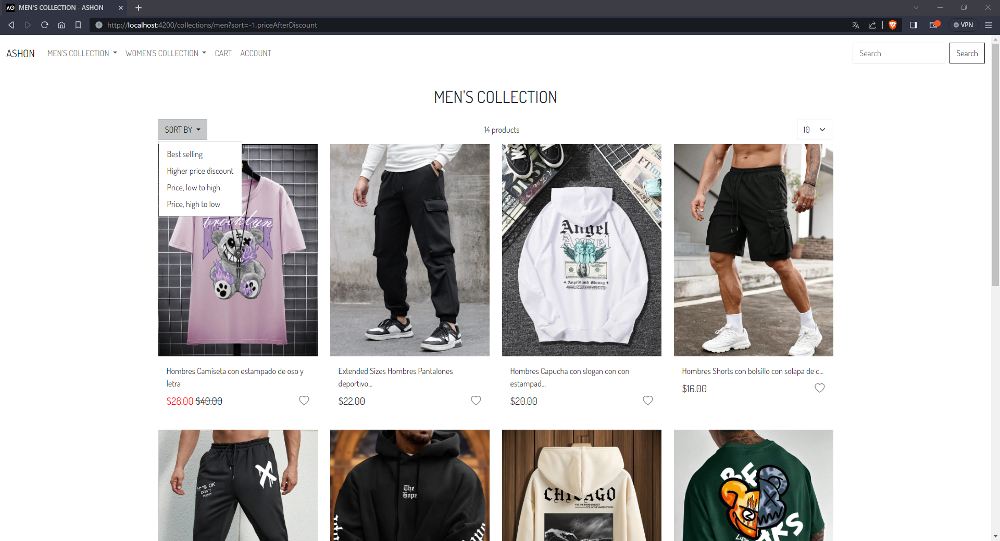
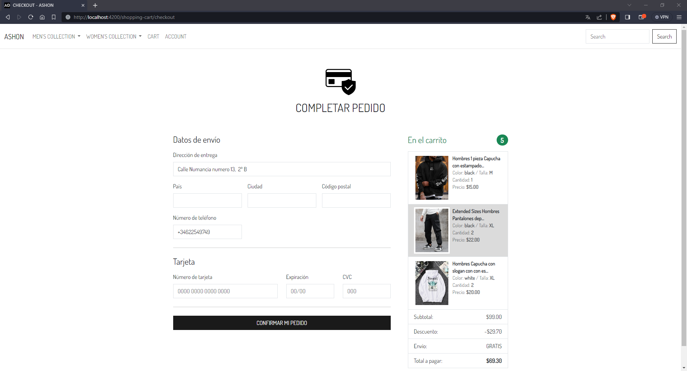

<!-- PROJECT LOGO -->
 

  

<h2 align="center">ASHON STORE</h2>

# Demo 1 "Add to cart"

https://github.com/ricardohuaripata/ASHON-Ecommerce-Client/assets/102578959/9228dcb9-8099-4555-bcc3-ea92eb5eeb5b

# Demo 2 "Google login"

https://github.com/ricardohuaripata/ASHON-Ecommerce-Client/assets/102578959/c420ab55-5a01-49d0-a0bd-da4cbea7545c

